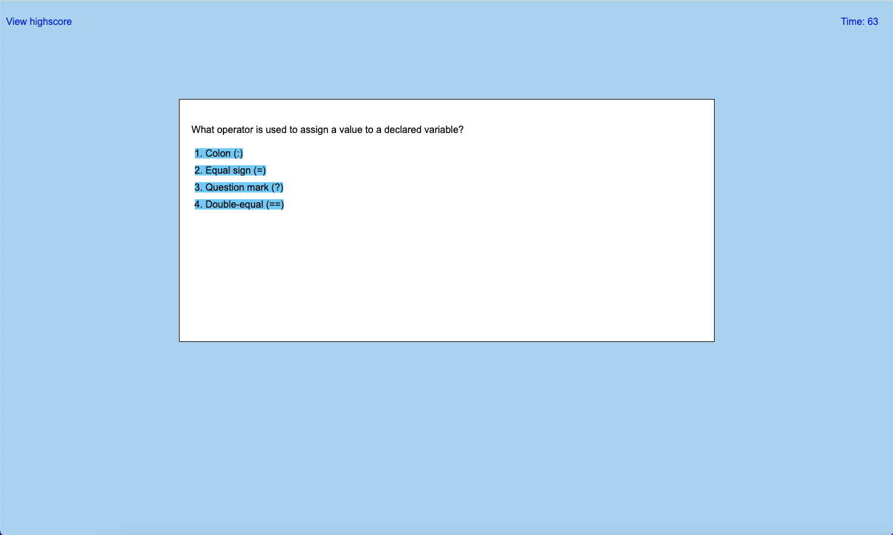

# Code Quiz Webpage

## Description

This application is a Javascript code assessment. It's built to help full-stack web developers to familiarize themselves with the coding tests that might be given to them during a job interview process. It's a timed multiple choice coding Javascript quiz that stores highscores to guage the progress of the web developer.

## Installation

N/A

## Usage

To use this app, first you  need to enter the following URL into your browser and hit enter:

Then, you will be presented with the first screen which has some information to read and the start quiz button that you can click on to start the quiz. Also there is a timer that will start running after  you click the start quiz button. At the top left there is a link to bring you to a screen where you can view the scores if there are any.

After you click the start quiz button, there will be a series of multiple choice questions that you will need to answer. The sooner you answer the questions the better your score will be. For every wrong question your score/timer will be penalized by subtracting 10 seconds from the timer. The quiz is over when the timer reaches zero or the questions are all answered. 

Then you will presented with another screen that will show you your final score. You will have to enter your initials to save your score.

The final screen is a screen that shows your scores.  There are two buttons in this screen that you can click. One to exit the screen and the other to clear up the scores.

Screenshots:

## Credits

N/A

## License

Please refer to the LICENSE in the repo.